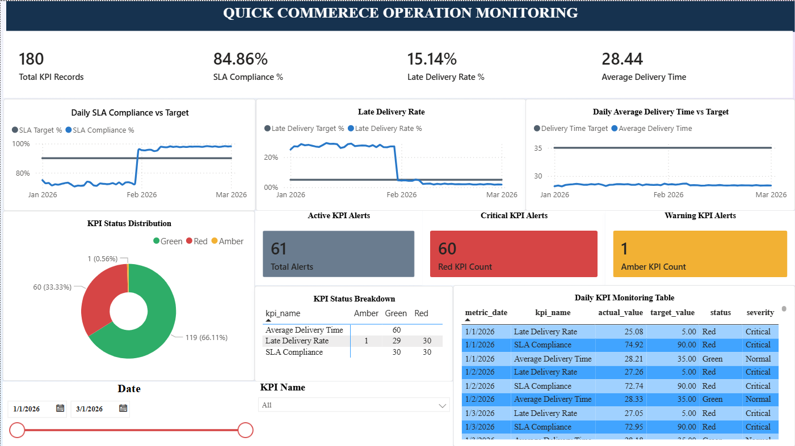

# Quick Commerce Operations Analytics & Monitoring Platform

An end-to-end operations analytics and monitoring platform inspired by quick-commerce business operations.

The project simulates a multi-city quick-commerce environment and demonstrates how transactional data can be generated, stored, analyzed, monitored, and visualized using **Python, PostgreSQL, SQL, Pandas, and Power BI**.

The platform includes automated daily data generation, operational KPI monitoring, SLA tracking, statistical anomaly detection, automated alert reporting, and an interactive Power BI monitoring dashboard.

---

## 📊 Power BI Monitoring Dashboard



The Power BI dashboard provides an operational monitoring view covering:

- SLA Compliance
- Late Delivery Rate
- Average Delivery Time
- KPI targets
- Green / Amber / Red KPI status
- Active KPI alerts
- Critical and warning alerts
- Daily KPI trends
- Target comparisons
- KPI status distribution
- Date and KPI filtering

Power BI file:

`powerbi/quick_commerce_monitoring.pbix`

---

# 🎯 Business Problem

Quick-commerce operations require continuous monitoring of order volume, delivery performance, and service-level targets across multiple cities, stores, and delivery partners.

Operations teams need visibility into:

- Order volume
- Delivery SLA performance
- Late deliveries
- Average delivery time
- City-level operational performance
- Delivery partner activity
- KPI threshold breaches
- Operational alerts
- Daily performance trends

A static dataset is useful for historical analysis but does not demonstrate how an operational monitoring system can continuously receive new data.

This project therefore implements an incremental data generation and monitoring pipeline that can extend the operational dataset day by day and update the downstream KPI monitoring layer.

---

# 💡 Solution

The project implements an end-to-end analytics and monitoring workflow:

```text
Python Data Generation
        │
        ▼
PostgreSQL Database
        │
        ▼
SQL Analytics
        │
        ▼
KPI Monitoring View
        │
        ├──────────────► Python Anomaly Detection
        │                         │
        │                         ▼
        │                  Alert / Monitoring Reports
        │
        ▼
Power BI Dashboard
```

The architecture separates:

- Transactional data generation
- Database storage
- SQL analytics
- KPI calculation
- KPI threshold monitoring
- Statistical anomaly detection
- Alert generation
- Business intelligence visualization

---

# 🏗️ Project Architecture

```text
                    ┌─────────────────────────┐
                    │   Python Data Pipeline  │
                    │                         │
                    │ Seed Data               │
                    │ Daily Transactions      │
                    │ Automated Daily Pipeline│
                    └────────────┬────────────┘
                                 │
                                 ▼
                    ┌─────────────────────────┐
                    │      PostgreSQL         │
                    │                         │
                    │ 12 Normalized Tables    │
                    │ Customers               │
                    │ Stores                  │
                    │ Products                │
                    │ Orders                  │
                    │ Inventory               │
                    │ Deliveries              │
                    │ Payments                │
                    └────────────┬────────────┘
                                 │
                                 ▼
                    ┌─────────────────────────┐
                    │      SQL Analytics      │
                    │                         │
                    │ Operational KPIs        │
                    │ Order Analytics         │
                    │ Delivery Analytics      │
                    │ SLA Monitoring          │
                    │ KPI Monitoring View     │
                    └────────────┬────────────┘
                                 │
                    ┌────────────┴────────────┐
                    ▼                         ▼
          ┌──────────────────┐      ┌──────────────────┐
          │ Python Monitoring│      │     Power BI     │
          │                  │      │                  │
          │ IQR Anomalies    │      │ KPI Dashboard    │
          │ Monitoring Report│      │ KPI Trends       │
          │ Alert Reports    │      │ Target Analysis  │
          └──────────────────┘      └──────────────────┘
```

---

# 🗄️ Database Design

The project uses a normalized PostgreSQL database containing **12 core tables**.

## Core Entities

- Cities
- Calendar
- Customers
- Stores
- Products
- Delivery Partners
- Orders
- Order Items
- Inventory
- Deliveries
- Payments
- Product Categories

The database design includes:

- Primary keys
- Foreign keys
- ENUM-based order status
- CHECK constraints
- UNIQUE constraints
- Composite uniqueness
- Referential integrity
- Price snapshotting at order time
- Calendar dimension
- Relational relationships between operational entities

Database schema:

`database/schema.sql`

Entity Relationship Diagram:

`docs/er_diagram.png`

---

# 🐍 Python Data Generation

Python is used to generate realistic synthetic operational data for the quick-commerce environment.

The data generation layer creates both reference/master data and transactional data.

## Reference Data

The project generates:

- Cities
- Product Categories
- Products
- Stores
- Delivery Partners
- Customers
- Calendar
- Inventory

## Transactional Data

The transaction pipeline generates:

- Orders
- Order Items
- Deliveries
- Payments

The generated data represents multiple cities, stores, products, customers, and delivery partners.

---

# 🛒 Order Lifecycle

The simulated order lifecycle follows a typical quick-commerce workflow:

```text
Placed
   ↓
Confirmed
   ↓
Packed
   ↓
Partner Assigned
   ↓
Out for Delivery
   ↓
Delivered
```

Orders may also be cancelled at an appropriate stage of the lifecycle.

The generated order data supports analysis of:

- Order volume
- Order status
- Revenue
- Average Order Value
- Cancellations
- Delivery performance
- City-level operations
- Daily operational trends

---

# 📈 Dataset

The current project dataset contains:

- **159,340+ orders**
- **60 days of operational data**
- Date range: **January 1, 2026 – March 1, 2026**
- Multiple cities
- Multiple stores
- Multiple delivery partners
- Simulated cancellations
- Simulated delivery delays
- Delivery SLA monitoring

Daily order volume uses configurable compound growth to simulate an expanding operational environment.

The latest generated day can be extended through the automated pipeline without manually changing the historical simulation dates.

---

# 🚚 Delivery SLA Monitoring

The project uses a simulated delivery SLA of:

```text
20 minutes
```

The delivery pipeline determines whether a delivery exceeds the configured SLA.

The SLA information is then used for operational KPI monitoring.

## Key Delivery KPIs

### SLA Compliance

Percentage of deliveries completed within the defined SLA.

Target:

```text
≥ 90%
```

### Late Delivery Rate

Percentage of deliveries exceeding the defined SLA.

Target:

```text
≤ 5%
```

### Average Delivery Time

Average delivery duration used to monitor overall delivery efficiency.

Target:

```text
≤ 35 minutes
```

---

# 🚦 KPI Monitoring

The project contains a dedicated KPI monitoring layer implemented using SQL.

Each KPI is compared against a defined business threshold and classified into a status:

- Green
- Amber
- Red

The monitoring layer also assigns a severity:

- Normal
- Warning
- Critical

## KPI Thresholds

| KPI | Target | Green | Amber | Red |
|---|---:|---:|---:|---:|
| SLA Compliance | ≥ 90% | ≥ 90% | 85–89.99% | < 85% |
| Late Delivery Rate | ≤ 5% | ≤ 5% | >5–7% | >7% |
| Average Delivery Time | ≤ 35 min | ≤35 min | >35–40 min | >40 min |

The KPI monitoring dataset contains:

```text
metric_date
kpi_name
actual_value
target_value
status
severity
```

SQL implementation:

- `sql/04_kpi_monitoring.sql`
- `sql/05_create_monitoring_view.sql`

Reusable PostgreSQL monitoring view:

`vw_kpi_monitoring`

---

# 🔎 Statistical Anomaly Detection

The project implements statistical anomaly detection using the **Interquartile Range (IQR)** method.

For each KPI, the process:

1. Groups records by KPI.
2. Calculates Q1.
3. Calculates Q3.
4. Calculates the Interquartile Range.
5. Calculates lower and upper bounds.
6. Flags observations outside the statistical bounds.

Implementation:

`python/anomaly_detection.py`

Output:

`output/kpi_anomaly_results.csv`

The anomaly output contains:

```text
metric_date
kpi_name
actual_value
target_value
status
severity
q1
q3
lower_bound
upper_bound
anomaly
```

## Threshold Monitoring vs Anomaly Detection

The project intentionally separates business-rule monitoring from statistical anomaly detection.

For example:

- A KPI can be below a business target without being statistically anomalous.
- A KPI can be statistically unusual while still remaining within a business threshold.

This allows the monitoring system to identify both:

**Business KPI breaches**

and

**Statistically unusual observations**

---

# 🚨 Automated Alert Reporting

The project generates an alert report based on KPI monitoring results.

The alert pipeline identifies KPI records that require attention based on their monitoring status.

The alert report can contain:

- Date
- KPI
- Actual value
- Target value
- Status
- Severity
- Anomaly indicator

Alert generation script:

`python/generate_alert_report.py`

Output:

`output/kpi_alert_report.csv`

---

# 📋 Monitoring Report

A consolidated monitoring report is generated using the KPI monitoring dataset.

Script:

`python/monitoring_report.py`

Output:

`output/kpi_monitoring_report.csv`

The report provides a structured view of KPI performance and status across the available monitoring period.

---

# ⚙️ Automated Daily Data Pipeline

The project includes an automated daily data generation pipeline.

Instead of manually changing dates in the simulation code, the automation determines the next operational day directly from the PostgreSQL database.

The pipeline performs:

```text
1. Find the latest order date
            ↓
2. Find the latest day's order volume
            ↓
3. Calculate the next date
            ↓
4. Calculate the next day's order volume
            ↓
5. Check whether the date already contains orders
            ↓
6. Generate only the missing day
            ↓
7. Leave existing historical data unchanged
```

Automation script:

`python/run_automated_pipeline.py`

Example execution:

```text
Latest database date : 2026-02-28
Latest day orders    : 5376
Next simulation date : 2026-03-01
Next day orders      : 5537
Generating data for 2026-03-01...
2026-03-01: 5537 orders created.
Automation step completed successfully.
```

The duplicate-date protection prevents the automation from generating the same operational day twice.

---

# 📊 Power BI Dashboard

The Power BI dashboard is connected to the PostgreSQL KPI monitoring view.

It provides a centralized operational monitoring interface.

## Dashboard Components

### KPI Cards

- Total KPI Records
- SLA Compliance
- Late Delivery Rate
- Average Delivery Time
- Active KPI Alerts
- Critical KPI Alerts
- Warning KPI Alerts

### Trend Analysis

- Daily SLA Compliance vs Target
- Daily Late Delivery Rate vs Target
- Daily Average Delivery Time vs Target

### Status Monitoring

- KPI Status Distribution
- KPI Status Breakdown
- Green / Amber / Red classification
- Severity monitoring

### Detailed Analysis

- Daily KPI Monitoring Detail
- Actual KPI values
- Target values
- KPI status
- Severity
- Date filtering
- KPI filtering

Power BI project file:

`powerbi/quick_commerce_monitoring.pbix`

---

# 🔄 End-to-End Monitoring Workflow

The complete monitoring workflow is:

```text
                 ┌───────────────────────┐
                 │ Python Data Generation│
                 └───────────┬───────────┘
                             │
                             ▼
                 ┌───────────────────────┐
                 │    PostgreSQL DB      │
                 └───────────┬───────────┘
                             │
                             ▼
                 ┌───────────────────────┐
                 │    SQL Analytics      │
                 └───────────┬───────────┘
                             │
                             ▼
                 ┌───────────────────────┐
                 │ KPI Monitoring View   │
                 └───────────┬───────────┘
                             │
                 ┌───────────┴───────────┐
                 ▼                       ▼
       ┌───────────────────┐   ┌───────────────────┐
       │ Anomaly Detection │   │    Power BI       │
       └─────────┬─────────┘   └───────────────────┘
                 │
                 ▼
       ┌───────────────────┐
       │ Alert Generation  │
       └───────────────────┘
```

---

# 📁 Generated Outputs

The project generates machine-readable monitoring outputs in the `output/` directory.

```text
output/
├── kpi_alert_report.csv
├── kpi_anomaly_results.csv
└── kpi_monitoring_report.csv
```

These outputs can be used for further analysis or integrated into downstream reporting workflows.

---

# 🛠️ Technology Stack

| Layer | Technology |
|---|---|
| Programming | Python |
| Database | PostgreSQL |
| Database Connectivity | psycopg2 |
| Synthetic Data Generation | Faker |
| Data Analysis | Pandas |
| Data Processing | NumPy / Pandas |
| Analytics | SQL |
| Visualization | Power BI |
| Dashboard Calculations | DAX |
| Version Control | Git / GitHub |
| Configuration | python-dotenv |

---

# 📂 Repository Structure

```text
quick-commerce-analytics/
│
├── database/
│   └── schema.sql
│
├── docs/
│   ├── er_diagram.png
│   └── power_bi_dashboard.png
│
├── output/
│   ├── kpi_alert_report.csv
│   ├── kpi_anomaly_results.csv
│   └── kpi_monitoring_report.csv
│
├── powerbi/
│   ├── quick_commerce_monitoring.pbix
│   └── README.md
│
├── python/
│   ├── anomaly_detection.py
│   ├── db_connection.py
│   ├── generate_alert_report.py
│   ├── generate_daily_orders.py
│   ├── generate_data.py
│   ├── monitoring_report.py
│   ├── run_30_day_simulation.py
│   ├── run_automated_pipeline.py
│   ├── seed_calendar.py
│   ├── seed_categories.py
│   ├── seed_cities.py
│   ├── seed_customers.py
│   ├── seed_delivery_partners.py
│   ├── seed_inventory.py
│   ├── seed_products.py
│   └── seed_stores.py
│
├── sql/
│   ├── 01_execution_KPIS.sql
│   ├── 02_order_operations.sql
│   ├── 03_delivery_sla_analytics.sql
│   ├── 04_kpi_monitoring.sql
│   ├── 05_create_monitoring_view.sql
│   └── README.md
│
├── .env
├── .env.example
├── .gitignore
├── requirements.txt
└── README.md
```

> **Note:** `.env` contains local database credentials and must not be committed to GitHub. It is shown above only to describe the local project structure.

---

# 🚀 Setup

## 1. Clone the Repository

```bash
git clone <repository-url>
cd quick-commerce-analytics
```

## 2. Create a Python Environment

### Windows

```bash
python -m venv venv
venv\Scriptsctivate
```

### Linux / macOS

```bash
python3 -m venv venv
source venv/bin/activate
```

## 3. Install Dependencies

```bash
pip install -r requirements.txt
```

## 4. Configure Database Credentials

Create a `.env` file using `.env.example` as the template.

Example:

```text
DB_HOST=localhost
DB_PORT=5432
DB_NAME=quick_commerce_db
DB_USER=postgres
DB_PASSWORD=your_password
```

Do not commit the actual `.env` file.

## 5. Create the Database Schema

Create the PostgreSQL database and execute:

`database/schema.sql`

## 6. Seed Reference Data

Run the required seed scripts:

```bash
python python/seed_cities.py
python python/seed_categories.py
python python/seed_products.py
python python/seed_stores.py
python python/seed_delivery_partners.py
python python/seed_calendar.py
python python/seed_customers.py
python python/seed_inventory.py
```

## 7. Generate Transactional Data

For daily data generation:

```bash
python python/generate_daily_orders.py
```

For controlled multi-day simulation:

```bash
python python/run_30_day_simulation.py
```

For incremental daily generation after the initial dataset:

```bash
python python/run_automated_pipeline.py
```

The automated pipeline determines the next date from the database and avoids duplicate date generation.

## 8. Run KPI Monitoring

Run anomaly detection:

```bash
python python/anomaly_detection.py
```

Generate the monitoring report:

```bash
python python/monitoring_report.py
```

Generate the alert report:

```bash
python python/generate_alert_report.py
```

## 9. Open Power BI

Open:

`powerbi/quick_commerce_monitoring.pbix`

Refresh the Power BI dataset to load the latest KPI data from PostgreSQL.

---

# 📌 SQL Analytics

The SQL layer contains separate scripts for different analytical requirements.

## 01 — Execution KPIs

`sql/01_execution_KPIS.sql`

Includes operational execution metrics such as:

- Order volume
- Revenue
- Average Order Value
- Daily performance

## 02 — Order Operations

`sql/02_order_operations.sql`

Includes:

- Order trends
- Weekly order volume
- Week-over-week growth
- Operational order analysis

## 03 — Delivery SLA Analytics

`sql/03_delivery_sla_analytics.sql`

Includes:

- Average delivery time
- City-level delivery time
- Overall SLA performance
- City-level SLA performance
- Daily SLA trends
- Peak vs non-peak SLA performance
- Delivery partner analysis

## 04 — KPI Monitoring

`sql/04_kpi_monitoring.sql`

Defines KPI targets and status classification.

## 05 — Monitoring View

`sql/05_create_monitoring_view.sql`

Creates:

`vw_kpi_monitoring`

which acts as the analytical interface between PostgreSQL and Power BI.

---

# 📈 Key Metrics

The project focuses on operational monitoring rather than only descriptive reporting.

| Metric | Purpose |
|---|---|
| Order Volume | Monitor demand and operational scale |
| Revenue | Monitor transaction value |
| Average Order Value | Monitor average transaction size |
| SLA Compliance | Measure deliveries completed within SLA |
| Late Delivery Rate | Monitor delayed deliveries |
| Average Delivery Time | Monitor delivery efficiency |
| KPI Status | Identify threshold breaches |
| KPI Severity | Prioritize operational attention |
| Statistical Anomaly | Identify unusual KPI behavior |

---

# 🔐 Security

Database credentials are loaded through environment variables.

Sensitive credentials are not hard-coded into the Python source files.

Use:

`.env`

for local configuration and keep it excluded through `.gitignore`.

A safe configuration template is provided through:

`.env.example`

---

# 🧠 Skills Demonstrated

This project demonstrates practical experience with:

- Python
- PostgreSQL
- SQL
- Pandas
- DAX
- Power BI
- Relational Database Design
- Data Modeling
- ETL Concepts
- Synthetic Data Generation
- KPI Development
- Operations Analytics
- SLA Monitoring
- Threshold-Based Monitoring
- Statistical Anomaly Detection
- Alert Generation
- Data Visualization
- Git
- GitHub
- Environment Configuration

---

# 🔮 Future Improvements

Possible extensions include:

- Scheduled automated execution
- Automated Power BI dataset refresh
- Email or Microsoft Teams alert notifications
- Cloud deployment
- REST API integration
- Docker containerization
- Apache Airflow orchestration
- Real-time event streaming
- Advanced anomaly detection
- Predictive delivery-delay modeling
- Forecasting of order demand

These are potential future extensions and are not part of the current implementation.

---

# 📌 Current Project Status

## Completed

- [x] PostgreSQL database design
- [x] 12-table normalized data model
- [x] Database constraints and relationships
- [x] Reference/master data generation
- [x] Synthetic transactional data generation
- [x] Multi-city operational dataset
- [x] 60 days of transactional data
- [x] 159K+ simulated orders
- [x] SQL operational analytics
- [x] Delivery SLA analytics
- [x] KPI target definitions
- [x] Green / Amber / Red KPI classification
- [x] PostgreSQL KPI monitoring view
- [x] Python IQR anomaly detection
- [x] Automated monitoring report
- [x] Automated alert report
- [x] Incremental daily data generation
- [x] Duplicate-date protection
- [x] Power BI monitoring dashboard
- [x] Git/GitHub version control

---

# 📊 Project Outcome

The completed project demonstrates an end-to-end operational monitoring workflow in which new transactional data can be added incrementally, operational KPIs are calculated through SQL, KPI thresholds are evaluated, statistical anomalies are identified using Python, alerts are generated, and the results are presented through a Power BI monitoring dashboard.

The project combines **data engineering, SQL analytics, Python-based monitoring, statistical analysis, and business intelligence** into a single portfolio project.

---

# 👤 Author

**Aditya Mishra**

B.Tech — Computer Science & Engineering (AI)

### Focus Areas

- Data Analytics
- SQL
- Python
- PostgreSQL
- Power BI
- Operations Analytics
- Monitoring & Reporting

---

## ⭐ Project Highlights

```text
159K+ Orders
60 Days of Data
12 Database Tables
3 Core Monitoring KPIs
IQR Anomaly Detection
Automated Daily Data Pipeline
Automated Alert Reporting
Interactive Power BI Dashboard
```
